<div align="center">


<h1>Enterprise Platform Accelerator</h1>

<p><strong>The Global Standard for Industrialized Internal Developer Platforms and Developer Experience</strong></p>

[]()
[]()
[]()
[]()

<br/>

> **"Industrializing developer experience to unlock engineering velocity at scale."** 
> Enterprise Platform Accelerator (EPA) is a flagship repository designed to enable global organizations to design, deploy, and govern Internal Developer Platforms (IDP) through secure golden paths, self-service infrastructure, and automated delivery ecosystems.

</div>

---

## 🏛️ Executive Summary

**Enterprise Platform Accelerator (EPA)** is a flagship repository designed for CIOs, CTOs, and Platform Engineering Leaders. As organizations transition from fragmented DevOps practices to unified platform engineering models, the need for a standardized, secure, and developer-centric internal platform becomes the critical path for engineering productivity and software reliability.

This platform provides an industrialized approach to **Platform Engineering**, delivering production-ready **Developer Portals**, **Golden Path Templates**, **GitOps Governance**, and **Self-Service Environments**. It supports **Azure**, **AWS**, and **GCP**, enabling organizations to transition from "Development Friction" to "Autonomous Engineering Excellence."

---

## 💡 Why Enterprise Platforms Matter

An enterprise platform is the "operating system" for modern engineering teams:
- **Democratized Infrastructure**: Enabling developers to provision governed environments without waiting for operations teams.
- **Cognitive Load Reduction**: Providing high-level "Golden Paths" that abstract the complexity of cloud and Kubernetes.
- **Accelerated Onboarding**: Reducing the time to "First Commit" from weeks to minutes through automated service templates.
- **Institutional Guardrails**: Enforcing security, compliance, and quality as a foundational capability of the platform.

---

## 🚀 Business Outcomes

### 🎯 Strategic Productivity Impact
- **Increased Engineering Velocity**: Reducing the lead time for new services by automating the foundational "plumbing."
- **Improved Reliability**: Standardizing delivery and infrastructure patterns to reduce incident frequency and recovery time.
- **Enhanced Developer Retention**: Providing elite tools and removing operational friction to drive developer satisfaction.
- **Cost Efficiency**: Implementing platform-level FinOps to optimize resource usage across thousands of developer environments.

---

## 🏗️ Technical Stack

| Layer | Technology | Rationale |
|---|---|---|
| **Platform Engine** | Python, Terraform, Crossplane | High-performance orchestration of golden paths and institutional guardrails. |
| **Control Plane** | FastAPI | High-performance API for portal orchestration, service cataloging, and platform health. |
| **Frontend** | React 18, Vite | Premium portal for executive dashboards, developer self-service, and service catalogs. |
| **Integrations** | Backstage, ArgoCD, GitHub | Deep integration with the leading ecosystem for IDP and GitOps delivery. |
| **Database** | PostgreSQL | Centralized repository for service inventory, platform state, and productivity metrics. |
| **Observability** | Prometheus / Grafana | Real-time monitoring of platform health, provisioning latency, and DORA metrics. |

---

## 📐 Architecture Storytelling: 85+ Diagrams

### 1. Executive High-Level Architecture
The holistic vision of the enterprise platform engineering journey.

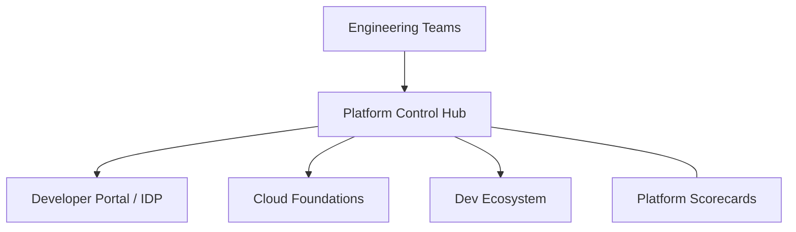

### 2. Detailed Platform Topology
The internal service boundaries and management layers of the industrialized IDP.

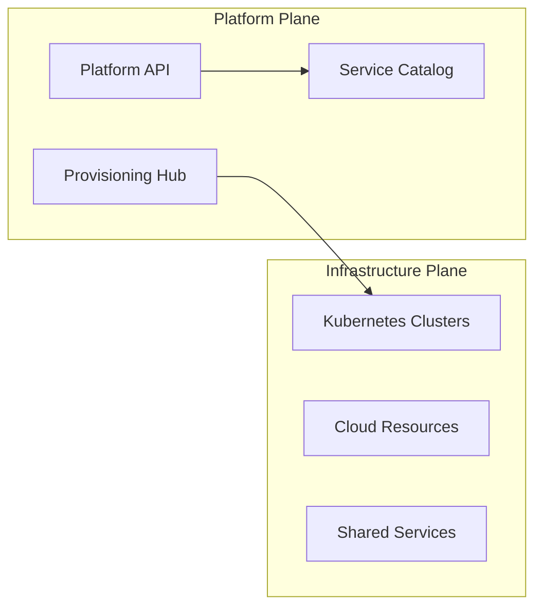

### 3. Developer to Production Request Path
Tracing the lifecycle of a new service from template selection to production deployment.

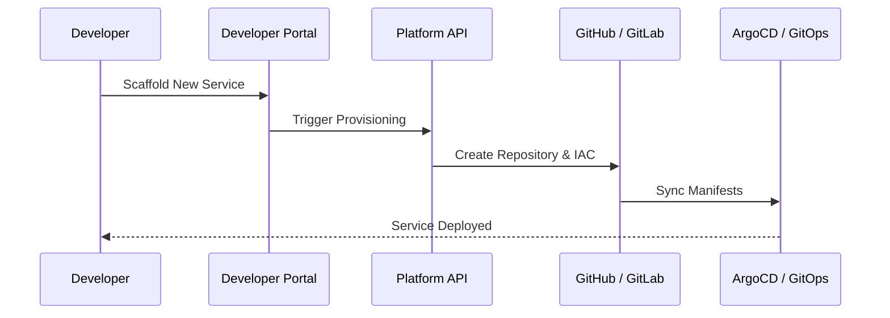

### 4. Platform Control Plane
The "Brain" of the framework managing global institutional standards and golden paths.

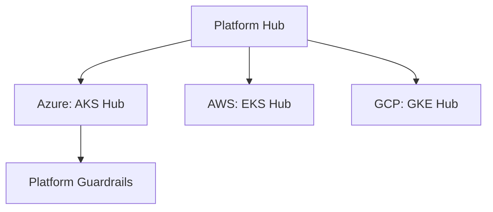

### 5. Multi-Cloud Topology
Synchronizing institutional platform standards across Azure, AWS, and GCP.

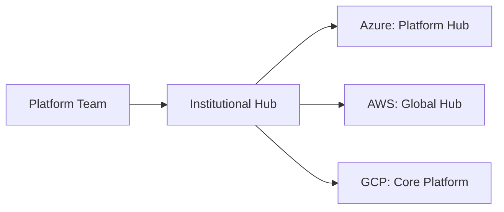

### 6. Regional Deployment Model
Hosting platform services close to the developers for low latency and high availability.

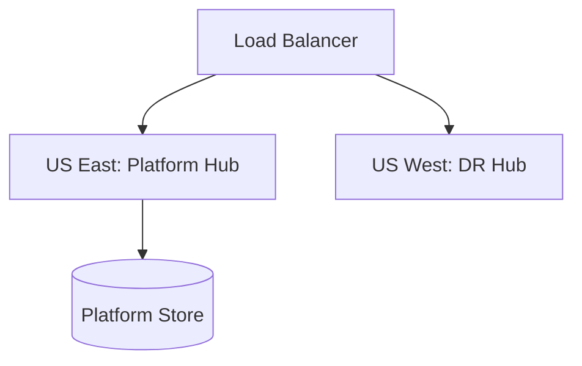

### 7. DR Failover Model
Ensuring platform continuity for critical developer services and automated delivery.

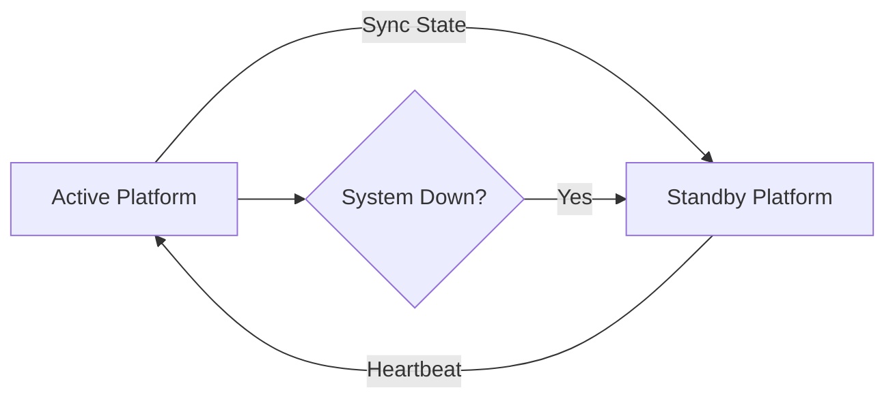

### 8. API Gateway Architecture
Securing and throttling the entry point for platform orchestration and service metadata.

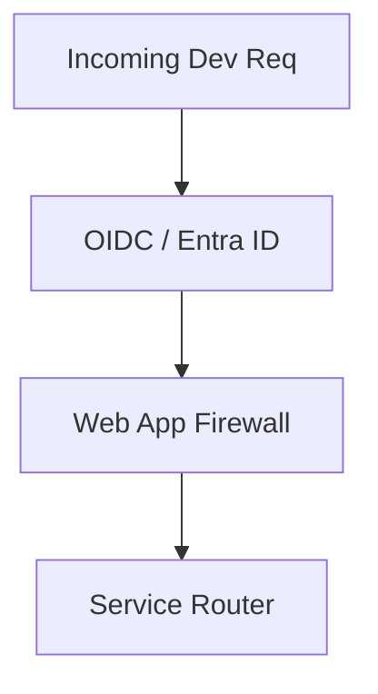

### 9. Queue Worker Architecture
Managing long-running provisioning and massive platform synchronization tasks.

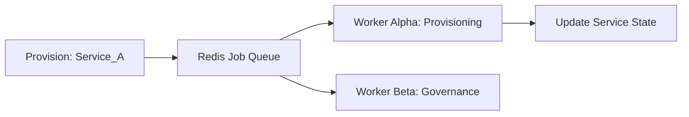

### 10. Dashboard Analytics Flow
How raw platform telemetry becomes executive engineering productivity scorecards.

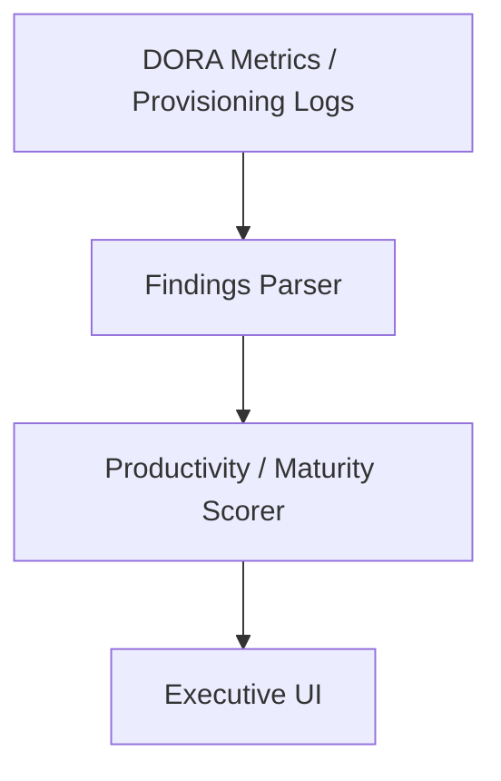

### 11. Developer Portal Workflow
The intuitive entry point for all engineering self-service tasks.

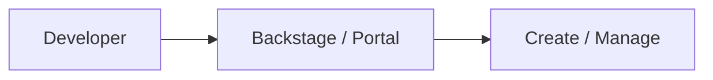

### 12. Backstage Reference Model
Standardizing institutional plugin management and software cataloging.

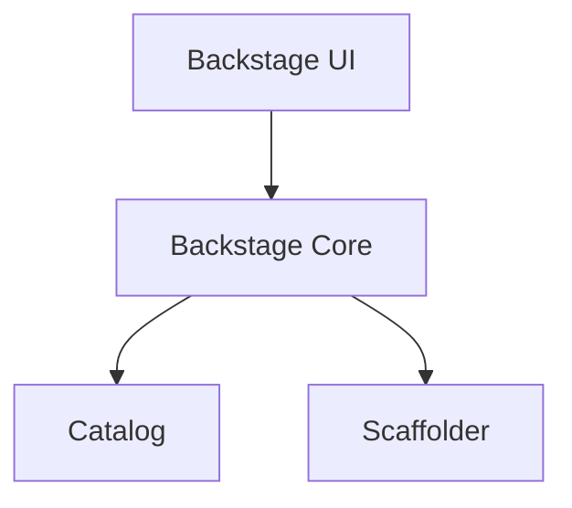

### 13. Golden Path Provisioning Flow
The industrialized path for delivering hardened, pre-approved service stacks.

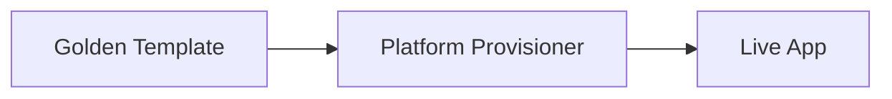

### 14. Template Catalog Model
Organizing institutional software templates for discovery and reuse.

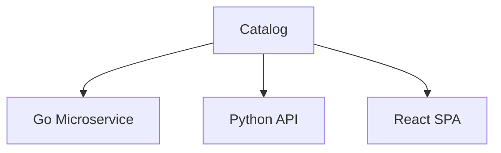

### 15. Service Onboarding Lifecycle
Managing the end-to-end journey of a new application on the platform.

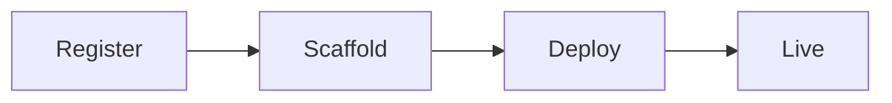

### 16. Namespace Request Workflow
Automating the secure isolation of team workloads in shared clusters.

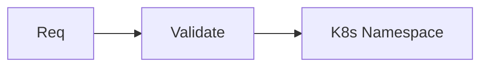

### 17. Environment Vending Model
Provisioning ephemeral or persistent environments for dev, test, and staging.

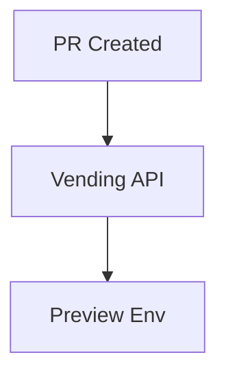

### 18. Shared Services Topology
Exposing centralized infrastructure (Redis, Postgres, Auth) as a platform service.

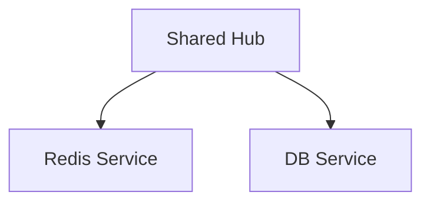

### 19. Tenant Isolation Architecture
Enforcing strict logical boundaries between different engineering teams.

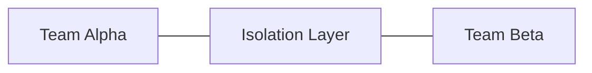

### 20. Platform API Ecosystem
The unified programmatic interface for all platform capabilities.

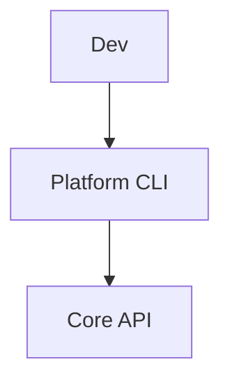

### 21. Commit to Deploy Workflow
Tracing the path of code from a local push to a production release.

```mermaid
graph LR
    Push[Push] --> CI[CI Build] --> CD[CD Deploy] --> Release[Release]
```

### 22. PR Validation Pipeline
Ensuring code quality and security before merging into the main branch.

```mermaid
graph TD
    PR[PR Open] --> Lint[Lint] --> Test[Test] --> Scan[Security Scan]
```

### 23. Artifact Packaging Model
Standardizing how container images and binaries are versioned and stored.

```mermaid
graph LR
    Build[Build] --> Pack[Packager] --> Registry[OCI Registry]
```

### 24. Versioning Lifecycle
Managing the semantic versioning and promotion of institutional platform assets.

```mermaid
graph LR
    Dev[v1.0.0-rc] --> Prod[v1.0.0]
```

### 25. Release Approval Flow
Automating the institutional governance checks required for production releases.

```mermaid
graph TD
    Rel[Release] --> Sec[Security Check] --> QA[QA Approval] --> Go[PROD]
```

### 26. GitOps Reconciliation Loop
The continuous process of syncing the live state with the desired Git state.

```mermaid
graph LR
    Git[Desired] <-> Argo[Reconciler] <-> K8s[Live]
```

### 27. ArgoCD Sync Model
Managing multi-cluster application delivery through GitOps.

```mermaid
graph TD
    App[App Definition] --> Argo[ArgoCD] --> C1[Cluster A]
```

### 28. Blue/Green Deployment Workflow
Enabling zero-downtime releases through environment switching.

```mermaid
graph LR
    User[User] --> LB[Switch] --> Blue[Old]
    LB -.-> Green[New]
```

### 29. Canary Release Model
Gradually rolling out new features to a small percentage of users.

```mermaid
graph TD
    Base[v1.0] --> Shift[Traffic Shift] --> Canary[v1.1: 5%]
```

### 30. Rollback Lifecycle
Automatically reverting to the last known good state when failures occur.

```mermaid
graph LR
    Fail[Failure] --> Trigger[Alert] --> Revert[Git Rollback]
```

### 31. Terraform Module Structure
Standardizing institutional infrastructure patterns for massive reuse.

```mermaid
graph TD
    Mod[Module] --> Net[Networking]
    Mod --> Comp[Compute]
```

### 32. Crossplane Provisioning Model
Managing cloud resources as native Kubernetes objects.

```mermaid
graph LR
    Claim[App Claim] --> Comp[Composition] --> Cloud[AWS/Azure/GCP]
```

### 33. Remote State Model
Securing the source of truth for global infrastructure configurations.

```mermaid
graph TD
    TF[Terraform] --> Store[S3 / Blob Storage]
```

### 34. Multi-Account Landing Zone
Providing secure, isolated environments for different platform services.

```mermaid
graph LR
    Org[Org] --> Acc1[Shared Services]
    Org --> Acc2[App Workloads]
```

### 35. Hub-Spoke Network Architecture
The enterprise standard for secure platform connectivity.

```mermaid
graph LR
    Hub[Hub] <-> Spoke1[VPC A]
```

### 36. AKS Platform Model
Hardened, governed Azure Kubernetes Service foundations.

```mermaid
graph TD
    AKS[AKS] --> Net[Azure CNI] --> Sec[Azure Policy]
```

### 37. EKS Platform Model
Enterprise-grade Elastic Kubernetes Service with standardized IAM.

```mermaid
graph TD
    EKS[EKS] --> VPC[VPC CNI] --> IAM[IAM Roles]
```

### 38. GKE Platform Model
Secure Google Kubernetes Engine foundations with Anthos fleet management.

```mermaid
graph TD
    GKE[GKE] --> Fleet[Fleet Manager]
```

### 39. Database Shared Service Model
Exposing managed databases (Postgres, SQL) to app teams via the platform.

```mermaid
graph TD
    Hub[DB Hub] --> Inst[App Instance]
```

### 40. Secrets Management Workflow
Securing application and platform credentials through centralized vaults.

```mermaid
graph TD
    App[App] --> Vault[Secret Vault]
```

### 41. OIDC / SSO Auth Flow
Standardizing developer and machine access via institutional identity.

```mermaid
graph LR
    User[Dev] --> SSO[Entra ID / Okta] --> Portal[IDP]
```

### 42. RBAC Model
Defining granular platform roles for Admins, Developers, and Auditors.

```mermaid
graph TD
    Role[Developer] --> Perm[Read Logs / Create SBX]
```

### 43. SAST/DAST Pipeline Model
Embedding static and dynamic security testing into the delivery flow.

```mermaid
graph LR
    Code[Code] --> SAST[SAST] --> Deploy[Deploy] --> DAST[DAST]
```

### 44. Supply Chain Security Flow
Ensuring the integrity and provenance of all platform and app components.

```mermaid
graph TD
    Src[Source] --> Sign[Sign Image] --> Verify[Verify at Runtime]
```

### 45. Vulnerability Remediation Cycle
Automating the detection and patching of security risks in the estate.

```mermaid
graph TD
    Detect[Found] --> Patch[Patch Job] --> Verify[Verify]
```

### 46. Incident Response Workflow
Standardized steps for handling a platform outage or security breach.

```mermaid
graph TD
    Alert[Alert] --> Assess[Assess] --> Contain[Contain]
```

### 47. SLO / Error Budget Model
Measuring platform reliability through objective performance targets.

```mermaid
graph LR
    Target[SLO: 99.9%] <-> Budget[Error Budget]
```

### 48. Metrics Pipeline
The journey of platform telemetry from clusters to central dashboards.

```mermaid
graph TD
    App[App] --> Prom[Prometheus] --> Graf[Grafana]
```

### 49. Logging Architecture
The unified path for application and platform logs to central operations.

```mermaid
graph LR
    Log[Log] --> Fluent[Forwarder] --> Hub[Loki/Elastic]
```

### 50. Tracing Model
Observing distributed requests across complex platform mesh architectures.

```mermaid
graph TD
    User[User] --> S1[Service A] --> S2[Service B]
```

### 51. Local Dev Environment Model
Standardizing the tools and configurations used by developers locally.

```mermaid
graph LR
    Docker[Docker] --- K3s[K3s / Kind] --- CLI[Platform CLI]
```

### 52. Inner Loop Workflow
The rapid cycle of coding, building, and testing on a developer's machine.

```mermaid
graph LR
    Code[Code] --> Build[Build] --> Test[Test]
    Test --> Code
```

### 53. Preview Environment Lifecycle
Automating the creation and cleanup of temporary PR environments.

```mermaid
graph TD
    PR[PR Open] --> Create[Create] --> PR[PR Closed] --> Purge[Delete]
```

### 54. CLI Developer Journey
Improving productivity through high-performance, command-line interfaces.

```mermaid
graph LR
    Cmd[epa init] --> Result[Scaffolded Project]
```

### 55. Docs Portal Search Flow
Enabling developers to find platform documentation through natural language.

```mermaid
graph LR
    Search[Search: Ingress] --> Docs[Docs Hub] --> Result[Guides]
```

### 56. Support Ticket Reduction Model
Using self-service and automation to deflect routine platform requests.

```mermaid
graph TD
    FAQ[Docs] --> Self[Self-Service] --> Ticket[Human Support]
```

### 57. Productivity Benchmark Model
Measuring and improving the key metrics that drive engineering success.

```mermaid
graph LR
    DORA[DORA Metrics] <-> SPACE[SPACE Framework]
```

### 58. Onboarding Day-1 Workflow
The industrialized path for getting a new engineer ready to code in hours.

```mermaid
graph TD
    Hire[New Hire] --> Portal[Access] --> FirstCommit[Success]
```

### 59. Quarterly Enablement Plan
Planning the education and upskilling of the engineering workforce.

```mermaid
graph LR
    Learn[Training] --> Build[Hackathon] --> Prod[Project]
```

### 60. Platform Adoption Roadmap
Strategic phases for migrating institutional workloads to the new IDP.

```mermaid
graph LR
    Pilot[Pilot] --> Scale[Org Wide]
```

### 61. Executive KPI Review Cycle
Aligning platform ROI with institutional business objectives.

```mermaid
graph TD
    Stats[Stats] --> Deck[Executive Summary]
```

### 62. DORA Metrics Scorecard
The industry standard for measuring software delivery performance.

```mermaid
graph LR
    Freq[Deployment Freq] --- Lead[Lead Time]
```

### 63. Cost Allocation Workflow
Linking platform and infrastructure spend to specific cost centers.

```mermaid
graph LR
    Usage[Usage] --> Cost[Cloud Bill] --> Dept[Business Unit]
```

### 64. Capacity Planning Model
Predicting future platform needs based on historical growth and scale.

```mermaid
graph TD
    Trend[Usage Trend] --> Forecast[Capacity Needs]
```

### 65. Team Benchmark Comparison
Benchmarking the delivery efficiency of different engineering squads.

```mermaid
graph TD
    Rank[Ranking] --> Leaderboard[Leaderboard]
```

### 66. Portfolio Governance Cadence
The periodic review of platform strategy and engineering outcomes.

```mermaid
graph LR
    Stats[Stats] --> Review[Review Board]
```

### 67. Vendor Management Workflow
Governing the lifecycle and security of third-party platform vendors.

```mermaid
graph LR
    Vendor[Vendor] --> Assess[Security Review]
```

### 68. Sustainability Dashboard Flow
Monitoring the green energy usage and carbon footprint of platform IT.

```mermaid
graph TD
    Usage[Usage] --> Carbon[CO2 Saved]
```

### 69. Enterprise Maturity Roadmap
The multi-year journey to a fully industrialized platform engineering model.

```mermaid
graph LR
    S1[Ad-Hoc] --> S4[Autonomous]
```

### 70. Continuous Improvement Loop
The ultimate feedback cycle for platform excellence and developer joy.

```mermaid
graph LR
    Test[Test] --> Learn[Learn] --> Evolve[Evolve]
    Evolve --> Test
```

### 71. AI Platform Assistant Flow
Enabling developers to interact with the platform via natural language.

```mermaid
graph LR
    User[Dev] --> LLM[AI Assistant] --> API[Platform API]
```

### 72. Policy-as-Code Governance
Enforcing institutional guardrails as versioned, testable code.

```mermaid
graph TD
    Rule[Code] --> Enforce[OPA / Kyverno]
```

### 73. Multi-country Operating Model
Governing global engineering teams under a single platform framework.

```mermaid
graph TD
    HQ[HQ] --> SiteA[US] --> SiteB[EU]
```

### 74. Regulated Workload Pattern
Specialized golden paths for banking, healthcare, or government apps.

```mermaid
graph TD
    Reg[HIPAA] --> Tpl[Regulated Template]
```

### 75. Hybrid Datacenter Extension
Extending the platform to legacy on-premise infrastructure.

```mermaid
graph LR
    Cloud[Cloud] <-> Hybrid[On-Prem K8s]
```

### 76. Edge Platform Extension
Managing workloads across distributed retail, factory, or edge sites.

```mermaid
graph TD
    Hub[Central Hub] --> Edge[Edge Nodes]
```

### 77. Data Platform Integration
Linking the IDP with enterprise data lakes and analytical stores.

```mermaid
graph LR
    App[App] <-> Data[Lakehouse]
```

### 78. Identity Federation Model
Unifying platform access across multiple identity providers.

```mermaid
graph TD
    IDP[Institutional IDP] <-> Fed[Federated Hub]
```

### 79. M&A Onboarding workflow
Rapidly integrating and standardizing acquired engineering teams.

```mermaid
graph LR
    MA[M&A] --> Scan[Scan] --> Adopt[Platform Adoption]
```

### 80. Innovation Portfolio Roadmap
Planning the next 36 months of institutional platform evolution.

```mermaid
graph TD
    Now[Now] --> Year3[AI-Native Platform]
```

### 81. Service Mesh Architecture
Standardizing service-to-service communication and security.

```mermaid
graph LR
    S1[Service A] <-> Mesh[Istio / Linkerd] <-> S2[Service B]
```

### 82. API Gateway Traffic Flow
Managing the ingress path for all platform and application APIs.

```mermaid
graph TD
    Net[Internet] --> GW[Gateway] --> App[App]
```

### 83. Queue Processing Lifecycle
Ensuring reliable asynchronous task execution at platform scale.

```mermaid
graph LR
    Push[Push] --> Q[Redis] --> Work[Worker]
```

### 84. Backup Recovery Model
Ensuring platform and application data durability across clouds.

```mermaid
graph TD
    Site[Active] --> Vault[Immutable Backup]
```

### 85. Change Management Workflow
Standardizing changes to the core platform infrastructure and API.

```mermaid
graph TD
    Req[Req] --> Review[Review] --> Execute[Approve]
```

---

## 🔬 Platform Engineering Methodology

### 1. The IDP Pillars
Our platform is built on four core pillars:
- **Developer Centricity**: Focused on reducing cognitive load and driving "Flow."
- **Self-Service**: Empowering teams to move fast without manual approvals.
- **Golden Paths**: Pre-approved, hardened templates for 90% of use cases.
- **Governance**: Policy-as-code enforced at the platform level.

### 2. Golden Path vs Silver Path
We provide "Golden Paths" (fully automated and managed) for standard workloads, while maintaining "Silver Paths" (standardized but more flexible) for specialized engineering needs.

---

## 🚦 Getting Started

### 1. Prerequisites
- **Terraform** (v1.5+).
- **Docker** & **Kubernetes**.
- **Python 3.10+**.

### 2. Local Setup
```bash
# Clone the repository
git clone https://github.com/Devopstrio/enterprise-platform-accelerator.git
cd enterprise-platform-accelerator

# Start the Platform Governance Control Plane
docker-compose up --build
```
Access the Developer Portal at `http://localhost:3000`.

---

## 🛡️ Governance & Security
- **Identity First**: Deep integration with Entra ID and OIDC for unified access.
- **Supply Chain Security**: Image signing and SBOM generation as a platform default.
- **FinOps**: Built-in cost attribution and departmental showback engines.

---
<sub>&copy; 2026 Devopstrio &mdash; Engineering the Future of Industrialized Developer Experience.</sub>
