<div align="center">


<h1>Enterprise Platform Accelerator</h1>

<p><strong>The Institutional-Grade Platform for Standardized Infrastructure Acceleration, Platform Orchestration Governance, and Multi-Cloud Ecosystem Delivery.</strong></p>

[]()
[]()
[]()

<br/>

> **"Industrializing infrastructure delivery to automate platform foundations."** 
> **Enterprise Platform Accelerator (EPA)** is an enterprise-grade platform designed to provide a secure, measurable, and highly automated foundation for global platform operations. It orchestrates the complex lifecycle of acceleration—from blueprint design and metadata ingestion to policy-driven provisioning and unified platform auditing.

</div>

---

## 🏛️ Executive Summary

Fragmented infrastructure silos and manual platform workflows are strategic operational liabilities; lack of centralized platform orchestration is a primary barrier to organizational cloud maturity. Organizations fail to maintain a secure infrastructure foundation not because of a lack of tools, but because of fragmented acceleration standards, lack of automated blueprint validation, and an inability to orchestrate platform planes with operational precision.

This platform provides the **Orchestration Intelligence Plane**. It implements a complete **Enterprise Platform-Accelerator-as-Code Framework**, enabling Platform and Infrastructure teams to manage global platform foundations as first-class citizens. By automating the identification of provisioning bottlenecks through real-time telemetry analysis and orchestrating the deployment of secure performance-driven acceleration policies, we ensure that every organizational service—from core landing zones to distributed cloud ecosystems—is governed by default, audited for history, and strictly aligned with institutional acceleration frameworks.

---

## 📐 Architecture Storytelling: Principal Reference Models

### 1. Principal Architecture: Global Enterprise Platform Accelerator & Orchestration Intelligence Plane
This diagram illustrates the end-to-end flow from blueprint ingestion and multi-cloud orchestration to guardrail enforcement, performance validation, and institutional platform auditing.

```mermaid
graph LR
    %% Subgraph Definitions
    subgraph BlueprintIngress["Blueprint & Metadata Ingress"]
        direction TB
        LandingZone_Skeletons["Azure / AWS / GCP Hub-Spoke skeletons"]
        Platform_Libraries["K8s / DB / Auth Orchestration Libs"]
        Security_Guardrails["Policy-as-Code / OPA / Sentinel Hubs"]
    end

    subgraph IntelligenceEngine["Orchestration Intelligence Hub"]
        direction TB
        API["FastAPI Accelerator Gateway"]
        PlatformOrchestrator["Global Platform & Blueprint Hub"]
        PolicyGuard_Hub["Governance & Compliance Guardrail Hub"]
        AIOps_Validator["Drift & Latency Analysis Hub"]
    end

    subgraph OperationsPlane["Distributed Cloud Ecosystem"]
        direction TB
        ManagedLandingZones["Managed Standardized Landing Zones"]
        ActiveFoundations["Managed Automated Cloud Foundations"]
        PlatformSinks["Managed Infrastructure Delivery Hubs"]
    end

    subgraph OperationsHub["Institutional Platform Hub"]
        direction TB
        Scorecard["Acceleration Maturity Scorecard"]
        Analytics["Platform Flow & Readiness Velocity Stats"]
        Audit["Forensic Acceleration Metadata Lake"]
    end

    subgraph DevOps["Enterprise-Platform-Accelerator-as-Code Framework"]
        direction TB
        TF["Terraform Acceleration Modules"]
        DriftBot["Acceleration & Config Drift Validator"]
        ChatOps["Acceleration Operations Hub"]
    end

    %% Flow Arrows
    BlueprintIngress -->|1. Submit Blueprint| API
    API -->|2. Orchestrate Acceleration| PlatformOrchestrator
    PlatformOrchestrator -->|3. Apply Policy Guard| PolicyGuard_Hub
    PolicyGuard_Hub -->|4. Assess Drift| AIOps_Validator
    
    AIOps_Validator -->|5. Execute Provision| OperationsPlane
    OperationsPlane -->|6. Notify Status| ChatOps
    API -->|7. Visualize Health| Scorecard
    
    Scorecard -->|8. Track Maturity| Analytics
    Scorecard -->|9. Record Provision| Audit
    
    TF -->|10. Provision Backbone| IntelligenceEngine
    DriftBot -->|11. Inject Provisioning Risk| PlatformOrchestrator
    Audit -->|12. Improve Operations| ManagedLandingZones

    %% Styling
    classDef ingress fill:#f5f5f5,stroke:#616161,stroke-width:2px;
    classDef intel fill:#e8eaf6,stroke:#1a237e,stroke-width:2px;
    classDef operations fill:#e1f5fe,stroke:#01579b,stroke-width:2px;
    classDef ops fill:#ede7f6,stroke:#311b92,stroke-width:2px;
    classDef devops fill:#e8f5e9,stroke:#1b5e20,stroke-width:2px;

    class BlueprintIngress ingress;
    class IntelligenceEngine intel;
    class OperationsPlane operations;
    class OperationsHub ops;
    class DevOps devops;
```

### 2. The Acceleration Lifecycle Flow
The continuous path of an infrastructure platform from initial design (blueprint) and ingest (metadata) to active accelerate (provision), enforce (policy), and institutional forensic auditing.

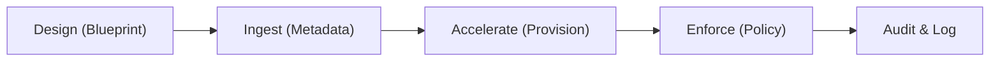

### 3. Distributed Platform Topology
Strategically orchestrating standardized landing zones and platforms across global cloud regions, diverse business units, and multi-cloud targets, providing a unified institutional view of global platform health and operational readiness.

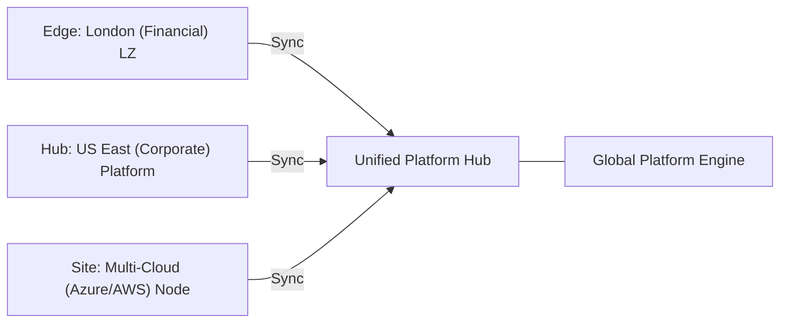

### 4. Blueprint Governance & High-Trust Data Plane Protection Flow
Executing complex logic for securing the bridge between platform architects and production environments, ensuring every organizational identity is verified and every acceleration access is according to institutional standards.

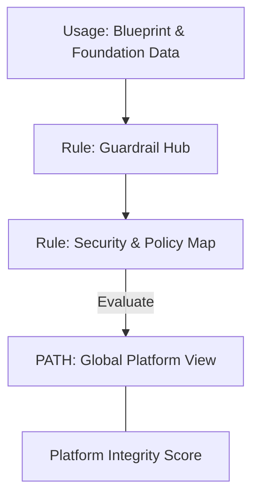

### 5. Multi-Cloud Federation & Governance Flow
Automatically managing unified platform standards across global regions and diverse cloud service providers, ensuring institutional data residency and security boundaries by default.

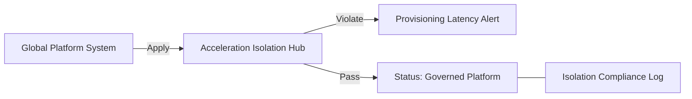

### 6. Encryption & Perimeter Protection Flow (Acceleration Standard)
Managing the lifecycle of an acceleration request, automatically enforcing institutional TLS 1.3 and resource encryption standards as required by security policy, ensuring zero-latency security confidence.

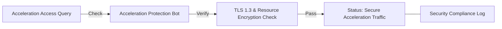

### 7. Institutional Acceleration Maturity Scorecard
Grading organizational performance based on key indicators: Blueprint Compliance Grade, Security Baseline Adoption Index, and Operational Readiness Index.

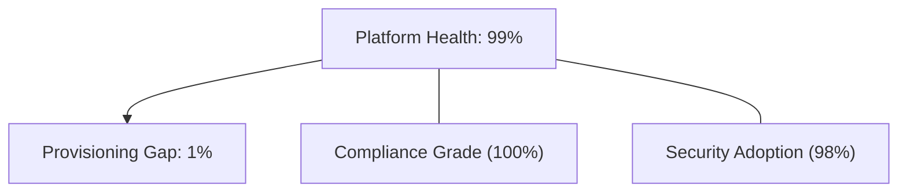

### 8. Identity & RBAC for Platform Governance
Managing fine-grained access to acceleration hubs, provisioning workers, and audit logs between Platform Architects, DevOps Engineers, and Compliance Leads.

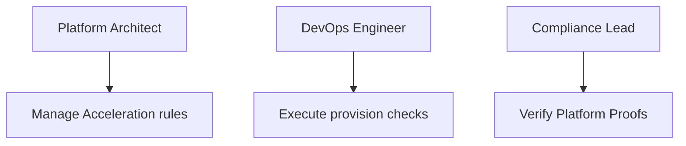

### 9. IaC Deployment: Enterprise-Platform-Accelerator-as-Code Framework
Using modular Terraform to deploy and manage the versioned distribution of the platform tracking hubs, policy protection workers, and forensic metadata lakes.

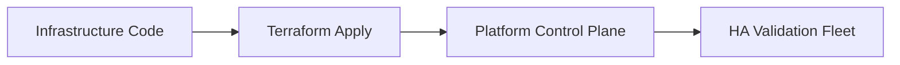

### 10. AIOps Acceleration Drift & Risk Validation Flow
Using advanced analytics to identify sudden surges in blueprint versions, unauthorized infrastructure changes, suspicious configuration drifts, or unusual platform pattern changes that could result in institutional risk.

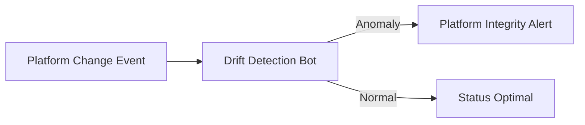

### 11. Metadata Lake for Forensic Acceleration Audit
Storing long-term records of every platform generated (metadata), every security event recorded, and every blueprint version history for institutional record-keeping, compliance auditing, and post-provisioning forensics.

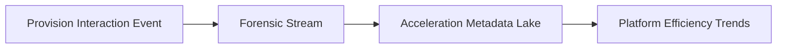

---

## 🏛️ Core Governance Pillars

1.  **Unified Foundation Coordination**: Maximizing resilience by centralizing all platform measurement through a single institutional plane.
2.  **Automated Platform Provisioning**: Eliminating "manual infrastructure" scenarios through proactive orchestration and pattern verification.
3.  **Sequential Blueprint Intelligence**: Ensuring zero-interruption operations through dependency-aware blueprint-driven infrastructure engineering.
4.  **Zero-Trust Guardrail Protection**: Automatically enforcing identity-based access and rule evaluation across all platform tiers.
5.  **Autonomous Operations Logic**: Guaranteeing reliability through automated industry-specific platform monitoring runbooks.
6.  **Full Acceleration Auditability**: Immutable recording of every blueprint change and platform provision for institutional forensics.

---

## 🛠️ Technical Stack & Implementation

### Platform Engine & APIs
*   **Framework**: Python 3.11+ / FastAPI.
*   **Performance Engine**: Custom Python-based logic for multi-cloud platform provisioning and DORA-style readiness metrics.
*   **Integrations**: Native connectors for Azure Resource Manager (ARM), AWS CloudFormation, and GCP Resource Manager APIs.
*   **Persistence**: PostgreSQL (Platform Ledger) and Redis (Live Policy State).
*   **Auth Orchestrator**: Federated OIDC/SAML for least-privilege platform management access.

### Governance Dashboard (UI)
*   **Framework**: React 18 / Vite.
*   **Theme**: Dark, Slate, Indigo (Modern high-fidelity platform aesthetic).
*   **Visualization**: D3.js for platform topologies and Recharts for readiness velocity analytics.

### Infrastructure & DevOps
*   **Runtime**: AWS EKS or Azure Kubernetes Service (AKS) for management plane.
*   **Platform Hub**: Managed event sourcing for immutable platform security timeline reconstruction.
*   **IaC**: Modular Terraform for deploying the acceleration landing zone and validation fleet.

---

## 🏗️ IaC Mapping (Module Structure)

| Module | Purpose | Real Services |
| :--- | :--- | :--- |
| **`infrastructure/platform_hub`** | Central management plane | EKS, PostgreSQL, Redis |
| **`infrastructure/enforcers`** | Distributed platform provisioners | Azure, AWS, GCP APIs |
| **`infrastructure/blueprint_pipes`** | Platform Ingestion Hubs | Webhooks, Lambda |
| **`infrastructure/auditing`** | Forensic platform sinks | S3, Athena, Quicksight |

---

## 🚀 Deployment Guide

### Local Principal Environment
```bash
# Clone the landing zone platform
git clone https://github.com/devopstrio/enterprise-platform-accelerator.git
cd enterprise-platform-accelerator

# Configure environment
cp .env.example .env

# Launch the EPA stack
make init

# Trigger a mock blueprint update and automated guardrail validation simulation
make simulate-epa
```

Access the Management Portal at `http://localhost:3000`.

---

## 📜 License
Distributed under the MIT License. See `LICENSE` for more information.

---
<div align="center">
  <p>© 2026 Devopstrio. All rights reserved.</p>
</div>
